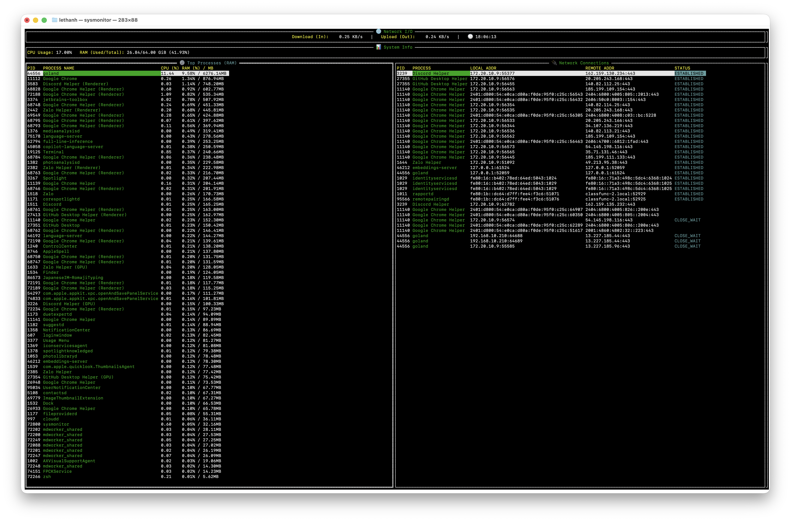

# System Monitor

A terminal-based system monitoring tool written in Go.



## Description

This tool provides a real-time view of your system's CPU usage, memory consumption, network activity, running processes,
and network connections. It's built using `tview` for the terminal user interface and `gopsutil` for data collection.

## Features

- **System Information:** Displays CPU and memory usage.
- **Network Statistics:** Shows download and upload speeds.
- **Process List:** Lists running processes with their PID, CPU usage, and memory usage.
- **Network Connections:** Shows active network connections with their associated process.
- **Interactive UI:**
    - Switch between the process and network connection tables using the `Tab` key.
    - Run `whois` on the remote address of a selected network connection.
    - Run `witr` on a selected process.
    - Open the local or remote address in a browser.

## Install:

```bash
go install github.com/zerolethanh/sysmonitor@latest
```

## Usage

```bash
sysmonitor
```

You can also specify the maximum number of processes to display (default 100):

```bash
sysmonitor -limit 50
```

### Keybindings

- `Tab`: Switch focus between the process table and the network connection table.
- `Enter` (on process table): Run `witr` for the selected process.
- `Enter` (on network connection table): Run `whois` for the remote address of the selected connection.
- `w` (on network connection table): Run `witr` for the process associated with the selected connection.
- `l` (on network connection table): Open the local address in a browser.
- `r` (on network connection table): Open the remote address in a browser.

## Dependencies

- [tview](https://github.com/rivo/tview)
- [gopsutil](https://github.com/shirou/gopsutil)
- [witr](https://github.com/pranshuparmar/witr) (for process inspection, requires separate installation)
- `whois` (for network lookups)
